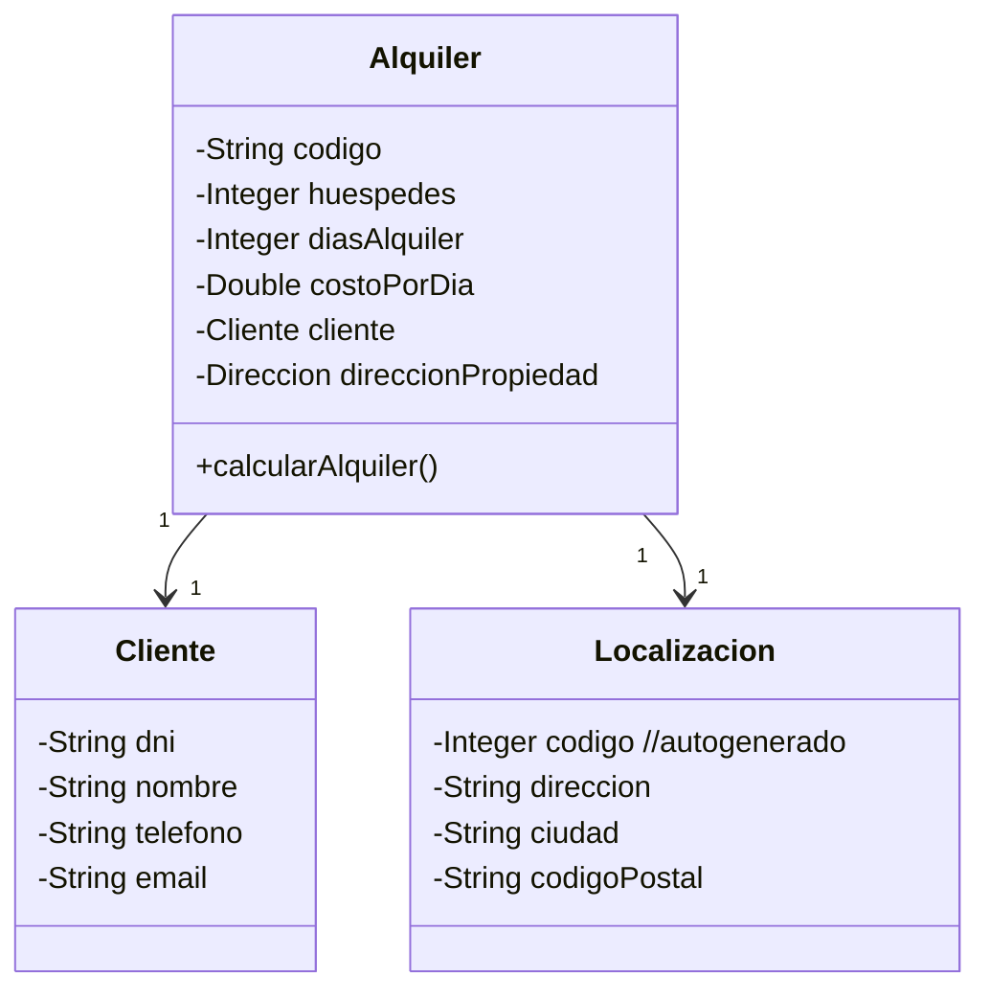

# Enunciado Clase Práctica - Procesador de CSV

Una inmobiliaria necesita procesar una serie de alquieres que se realizaron en sus propiedades durante la temporada de verano, en diversas localidades de la Argentina que se reparte entre las provincias de Córdoba, Rio Negro, Mendoza y Buenos Aires.

Para poder llevar a cabo una serie de análisis estadísticos, se cuenta con un un archivo csv que se llama [alquileres_verarno.csv](alquileres_verano.csv), el contenido de este archivo tiene por cada fila del mismo, la representacion del siguiente objeto.

En base a esto, realizar las siguiente tareas:
1. Importar el archivo provisto y generar un vector con todos los alquileres, repetando la estructura de clase
    > URL location = App.class.getResource("alquileres_verano.csv"); use esta linea para mapear el archivo desde la carpeta resources
2. Determinar la cantidad de alquileres que hay en Mendoza
3. Indicar el total que se recaudó por los alquileres
    > total = costoPorDia * diasAlquiler
4. Realizar los unit test que considere necesario